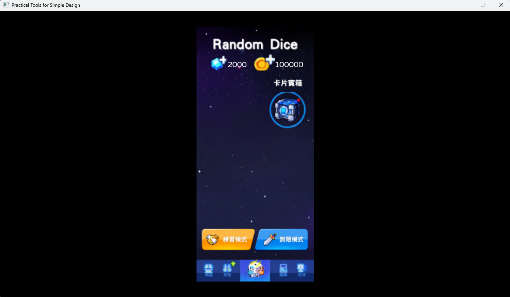
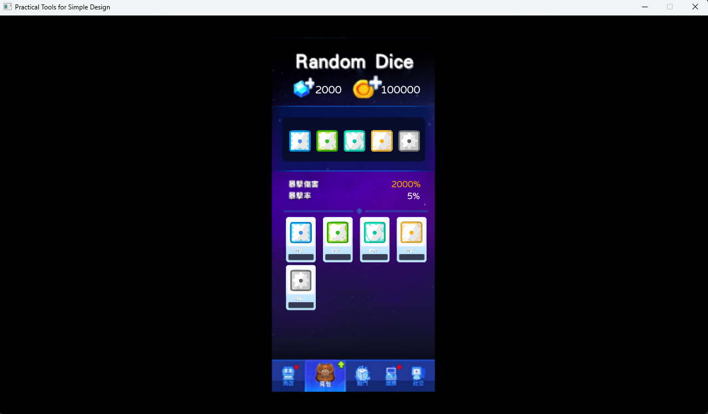

# 2026 OOPL Final Report

## 組別資訊

組別：T32
組員：葉又仁
復刻遊戲：骰子塔防 Random Dice

## 專案簡介
本專案基於 C++ 與物件導向設計 (OOP) 原則，復刻了經典策略遊戲《Random Dice》。遊戲核心在於玩家透過資源管理與隨機性機制，在有限的棋盤上合成骰子並提升火力，以抵禦不斷進攻的怪物波次。
### 遊戲簡介
這是一款結合了「塔防」與「隨機元素」的策略遊戲。核心亮點是玩家需透過合成相同星數的骰子來提升火力，並對抗由隨機性產生的敵方波次。
### 組別分工
一個人負責全部
## 遊戲介紹

### 遊戲規則
資源管理：玩家需消耗 SP 召喚骰子，並透過合成相同星數的骰子來升級。
防禦機制：怪物會依照固定路徑移動，若進入終點將扣除玩家生命值。
策略合成：透過不同骰子種類（如：冰骰減速、毒骰中毒、電骰彈射）組合出最佳防禦陣容。
BOSS 挑戰：每 10 波將遭遇特殊 BOSS，其具有獨特的技能（如：沉默、召喚、洗牌），大幅提升挑戰性。
### 遊戲畫面
目前分成主畫面，背包，練習模式(測試模式)以及無限模式(正常遊玩模式)，寶箱畫面

## 程式設計

### 程式架構
狀態管理：使用 enum class State 切換 START, MENU, UPDATE, GAMEOVER, CHEST, OPEN 等畫面。
物件導向設計：
Dice：基底類別，透過 virtual 函式擴充各類骰子的攻擊邏輯。
Monster：負責移動路徑計算、血量 UI 渲染及 BOSS 狀態機（冷卻與技能觸發）。
Bullet：處理飛行軌跡、碰撞檢測與子彈彈射屬性。
### 程式技術
記憶體管理：全面使用 std::shared_ptr 管理遊戲資產，有效避免 Memory Leak。
演算法實作:
彈射邏輯：利用後向尋敵演算法，計算子彈在擊中目標後，精準鎖定路徑上最近的下一隻怪物。
隨機性：應用 <random> 函式庫實現開箱的機率抽取，以及騎士王洗牌時的陣容重組。
除錯模式：實作快捷鍵機制（Z, X, C 召喚 BOSS；N 加 SP；M 清場），加速開發與測試效率。
### 使用到 AI/AI Agent 的部分 (沒有用到者，不需要寫這篇)
Gemini:我懂遊戲邏輯，所以我尋求AI幫助我一步一步建立程式架構，包括Dice、Moster等物件，還有initgame跟update的功能分離
## 結語

### 問題與解決方法
1.後期才發現背景跟視窗的座標系統不同，利用了偵測滑鼠點擊座標短暫應付，由於是專案末期才發現就沒有重構
### 自評

| 項次 | 項目                    | 完成 |
|------|------------------------|-------|
| 1    | 這是範例                |  V   |
| 2    | 完成專案權限改為 public  |  V  |
| 3    | 具有 debug mode 的功能   |  V  |
| 4    | 解決專案上所有 Memory Leak 的問題  |  V  |
| 5    | 報告中沒有任何錯字，以及沒有任何一項遺漏  |  V  |
| 6    | 報告至少保持基本的美感，人類可讀  |  V   |

### 心得
這次做《Random Dice》復刻，老實說，寫程式的時候才發現，想要「復刻」出那種隨機性跟策略感，真的比想像中難太多了！一開始規劃的時候只想做個簡單的怪物移動跟塔防，從骰子之間的互動到與BOSS之間的交互甚至是遊戲的UI實作真的是越來越複雜，後面要加入開箱系統跟資源體系後，整個架構變得更大更複雜，真的有一度寫到很想放棄。

印象最深的是在一開始畫UI的時候，對齊座標就花了老半天的時候，初期還在用傳統的 if-else 去寫那些判斷，結果程式碼變得很髒，還一直跑出那種找了半天都找不到的 Bug。後來把之前學到的 OOP 概念全部套進去，把骰子、怪物跟開箱邏輯分成不同類別管理，才終於讓程式碼變得稍微「人話」一點。

雖然因為臨時換主題（從原本的冰火姊弟換成骰子塔防）經歷了一陣手忙腳亂，但也因為這樣，我學到了怎麼在有限時間內快速擴充架構。這次報告不是什麼完美的作品，許多功能也沒有很完善，沒有一開始就選這個主題有點後悔，但這真的是我目前為止寫過最複雜、也最紮實的一支程式。雖然寫到快瘋掉，但最後看到遊戲能完整跑完一整套開箱抽骰子的流程，這種成就感真的是寫程式才懂的浪漫。
### 貢獻比例
葉又仁100%